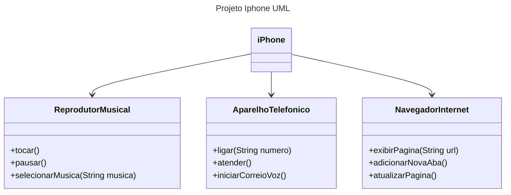

# IphoneJava
Uml e java de um projeto sobre iphone

```mermaid
---
title: Projeto Iphone UML
---
classDiagram
    class ReprodutorMusical {
        +tocar()
        +pausar()
        +selecionarMusica(String musica)
    }

    class AparelhoTelefonico {
        +ligar(String numero)
        +atender()
        +iniciarCorreioVoz()
    }

    class NavegadorInternet {  
        +exibirPagina(String url)
        +adicionarNovaAba()
        +atualizarPagina()
    }

    class iPhone {
    }

    iPhone --> ReprodutorMusical
    iPhone --> AparelhoTelefonico
    iPhone --> NavegadorInternet
```
